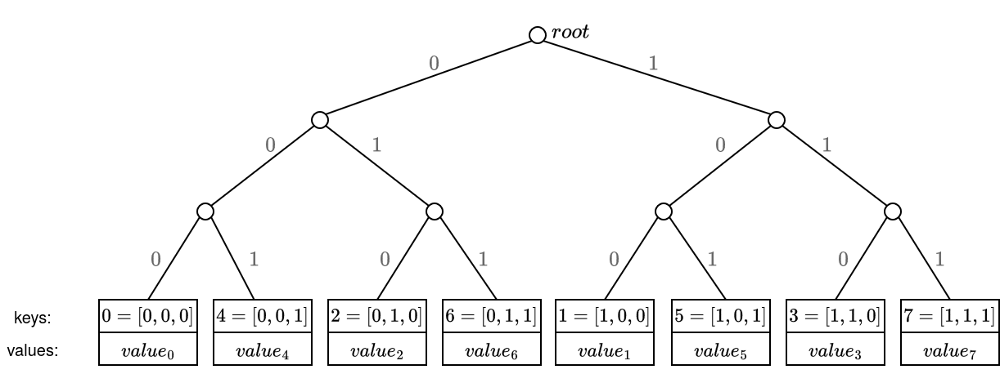
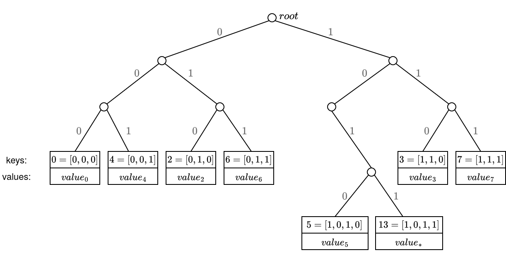

# MerkleTree

In the POD system, MerkleTrees are used to store the key-values of the POD. From the high level, we can think of it as a 'hashmap' storage, that allows us to generate proofs of inclusion and non-inclusion of the key-values stored into it.


## Leaves
Each leaf position is determined by the `key` content in binary representation (little-endian).

### Example 1
So for example, imagine we have 8 key-pairs, where the keys are just an enumeration from 0 to 7, then the tree leaves positions would look like:


Now let's change the key of the leaf `key=1`, and set it as `key=13`. Then, their respective leaf paths will be the same until they diverge in the 4-th bit:




### Example2

Suppose we have 4 key-values, where the keys are `0000`, `0100`, `1010` and `1011`. The tree would look like:


To iterate this example, suppose we have the following data in a POD:
```js
{
	id: "11000...",
	kvs : {
		idNumber: "424242",
		dateOfBirth: 1169909384,
		userPk: 9876543210, // target user of this POD
		_signerPk: 1234567890, // signer of the POD
	},
	// ...
}
```

The merkletree will contain the key values from the `kvs` field.

Suppose that the binary representation of the key `userPk` is `1011...`. This uniquely defines the leaf position that contains the public key of the authenticated user. Similarly for the other key-values:


## Proofs of inclusion and non-inclusion
Merkle proofs contain the siblings along the path from the leaf to the root, where the leaf position is determined by the key binary representation. 

Since leaf positions are deterministic based on the key, the same approach is used for non-inclusion proofs, where it can be proven that a key is not in the tree, and furthermore, that a value is not in the tree (although the key exists):
1. Proving that the key does not exist in the tree is achieved by generating the merkle-proof for the specific key, and showing that the (virtual) leaf is empty - this is, showing that going down the path of the non-existing key, there is a leaf with a different key, meaning that the non-existing key has not been inserted in the tree.
2. Proving that a value is not in the tree (although the key exists) is achieved by generating the merkle-proof for the specific key, and showing that the leaf exists but it has a different value than the one being proved.

For the current use cases, we don't need to prove that the key exists but the value is different on that leaf, so we only use the option 1.


## Encoding
> TODO: how key-values, nodes, merkle-proofs, ... are encoded.

## Interface

```rust
impl MerkleTree {
    /// builds a new `MerkleTree` where the leaves contain the given key-values
    fn new(kvs: HashMap<Value, Value>) -> Self;
    
    /// returns the root of the tree
    fn root(&self) -> Result<Hash>;
    
    /// returns a proof of existence, which proves that the given key exists in
    /// the tree. It returns the `value` of the leaf at the given `key`, and
    /// the `MerkleProof`.
    fn prove(&self, key: &Value) -> Result<(Value, MerkleProof)>;
    
    /// returns a proof of non-existence, which proves that the given `key`
    /// does not exist in the tree
    fn prove_nonexistence(&self, key: &Value) -> Result<MerkleProof>;
    
    /// verifies an inclusion proof for the given `key` and `value`
    fn verify(root: Hash, proof: &MerkleProof, key: &Value, value: &Value) -> Result<()>;
    
    /// verifies a non-inclusion proof for the given `key`, that is, the given
    /// `key` does not exist in the tree
    fn verify_nonexistence(root: Hash, proof: &MerkleProof, key: &Value) -> Result<()>;
    
    /// returns an iterator over the leaves of the tree
    fn iter(&self) -> std::collections::hash_map::Iter<Value, Value>;
}
```

## Development plan
- short term: merkle tree as a 'precompile' in POD operations, which allows to directly verify proofs
	- initial version: just a wrapper on top of the existing Plonky2's MerkleTree
	- second iteration: implement the MerkleTree specified in this document
- long term exploration:
	- explore feasibility of using Starky (for lookups) connected to Plonky2, which would allow doing the approach described at [https://hackmd.io/@aardvark/SkJ-wcTDJe](https://hackmd.io/@aardvark/SkJ-wcTDJe)


## Resources
- [https://docs.iden3.io/publications/pdfs/Merkle-Tree.pdf](https://docs.iden3.io/publications/pdfs/Merkle-Tree.pdf)
- [https://eprint.iacr.org/2018/955](https://eprint.iacr.org/2018/955)
