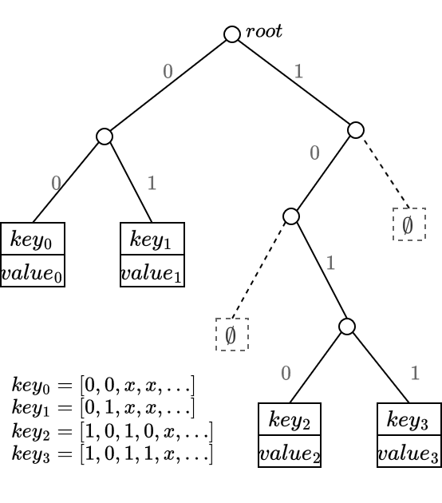
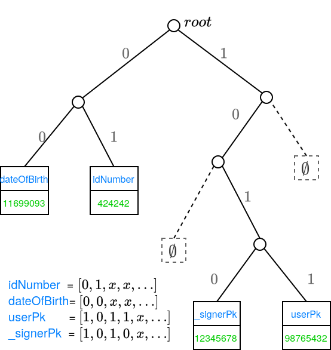

# MerkleTree

In the POD2 backend, a MerkleTree is used to store an unordered set of key-value pairs.  The frontend compound types `Array`, `Set`, and `Dictionary` are all represented as `MerkleTree`s on the backend.

From the high level, we can think of a `MerkleTree` as a 'hashmap' storage, that allows us to generate proofs of inclusion and non-inclusion of the key-values stored into it.

A `MerkleTree` is represented in-circuit as its Merkle root; in the Plonky2 backend, this root is a tuple of four field elements.  This makes a `MerkleTree` the same size in-circuit as the atomic types `Integer` and `String`.  (In general, regardless of the proof system used on the backend, all three types are represented in-circuit by the same number of field elements; this number is determined by the security requirement of the hash function.)

The encoding of the `MerkleTree` is a recursive process:
- Encode all keys and values in the `MerkleTree`.
- Put all keys and values into a sparse Merkle tree.
- The `MerkleTree` is encoded in-circuit as the root of this sparse Merkle tree.

This document explains the construction of the sparse Merkle tree.

## The branching rule

A sparse Merkle tree is implemented as a binary tree.  The insertion path of any key is given by a deterministic rule: given ```key``` and a nonnegative integer ```depth```, the rule determines that ```key``` belongs to either the ```left``` or ```right``` branch at depth ```depth```.

The precise rule is as follows.  In-circuit, compute a Poseidon hash of ```key``` to obtain a 4-tuple of field elements 
```
Poseidon(key) = (k_0, k_1, k_2, k_3).
```
Write the field elements in binary (in little-endian order):
```
k_0 = b_0 b_1 ... b_63
k_1 = b_64 b_65 ... b_127
....
```

At the root, ```key``` goes to the left subtree if ```b_0 = 0```, otherwise the right subtree.  At depth 1, ```key``` goes to the left subtree if ```b_1 = 0```, otherwise the right subtree, and similarly for higher depth.

## The tree structure

A Merkle tree with no entry at all is represented by the hash value
```root = hash(0).```
(With the Plonky2 backend, the hash function ```hash``` will output a 4-tuple of field elements.)

A Merkle tree with a single entry ```(key, value)``` is called a "leaf".  It is represented by the hash value
```root = hash((key, value, 1)).```

A Merkle tree ```tree``` with more than one entry is required to have two subtrees, ```left``` and ```right```.  It is then represented by the hash value
```root = hash((left_root, right_root, 2)).```

(The role of the constants 1 and 2 is to prevent collisions between leaves and non-leaf Merkle roots.  If the constants were omitted, a large Merkle tree could be dishonestly interpreted as a leaf, leading to security vulnerabilities.)

## Example 1

Suppose we want to build a Merkle tree from the following `Dictionary` with three key-value pairs:
```
{
    4: "even",
    5: "odd",
    6: "even"
}
```

The keys are integers, so the are represented in-circuit by themselves.  Let's suppose that in little-endian order, the first three bits of the hashes of the keys are:
```
hash(4) = 000...
hash(5) = 010...
hash(6) = 001...
```

The resulting tree looks like:
```
                root
              /      \
           L_root   R_root = hash(0)
          /      \
      LL_root   LR_root = hash((4, "even", 1))
      /    \
          LLR_root = hash((5, "odd", 1))
LLL_root = hash((6, "even", 1)).
```

The intermediate roots are computed as hashes of their subroots:
```
LL_root = hash((LLL_root, LLR_root, 2))
L_root = hash((LL_root, LR_root, 2))
root = hash((L_root, R_root, 2)).
```

The full `Dictionary` is then represented in the backend as `root` (four field elements in the Plonky2 backend).

### Example 2

Suppose we have 4 key-values, where the first four bits of the hashes of the keys are `0000`, `0100`, `1010` and `1011`. The tree would look like:


To iterate this example, suppose we have the following data in a POD:
```js
{
	id: "11000...",
	kvs : {
		idNumber: "424242",
		dateOfBirth: 1169909384,
		userPk: 9876543210, // target user of this POD
		_signerPk: 1234567890, // signer of the POD
	},
	// ...
}
```

The merkletree will contain the key values from the `kvs` field.

Suppose that the binary representation of the hash of the key `userPk` is `1011...`. This uniquely defines the leaf position that contains the public key of the authenticated user. Similarly for the other key-values:




## Proofs of inclusion and non-inclusion
Merkle proofs contain the siblings along the path from the leaf to the root, where the leaf position is determined by the key binary representation. 

Since leaf positions are deterministic based on the key, the same approach is used for non-inclusion proofs, where it can be proven that a key is not in the tree, and furthermore, that a value is not in the tree (although the key exists):
1. Proving that the key does not exist in the tree is achieved by generating the merkle-proof for the specific key, and showing that the (virtual) leaf is empty - this is, showing that going down the path of the non-existing key, there is a leaf with a different key, meaning that the non-existing key has not been inserted in the tree.
2. Proving that a value is not in the tree (although the key exists) is achieved by generating the merkle-proof for the specific key, and showing that the leaf exists but it has a different value than the one being proved.

For the current use cases, we don't need to prove that the key exists but the value is different on that leaf, so we only use the option 1.


## Encoding
> TODO: how key-values, nodes, merkle-proofs, ... are encoded.

## Interface

```rust
impl MerkleTree {
    /// builds a new `MerkleTree` where the leaves contain the given key-values
    fn new(kvs: HashMap<Value, Value>) -> Self;
    
    /// returns the root of the tree
    fn root(&self) -> Result<Hash>;
    
    /// returns a proof of existence, which proves that the given key exists in
    /// the tree. It returns the `value` of the leaf at the given `key`, and
    /// the `MerkleProof`.
    fn prove(&self, key: &Value) -> Result<(Value, MerkleProof)>;
    
    /// returns a proof of non-existence, which proves that the given `key`
    /// does not exist in the tree
    fn prove_nonexistence(&self, key: &Value) -> Result<MerkleProof>;
    
    /// verifies an inclusion proof for the given `key` and `value`
    fn verify(root: Hash, proof: &MerkleProof, key: &Value, value: &Value) -> Result<()>;
    
    /// verifies a non-inclusion proof for the given `key`, that is, the given
    /// `key` does not exist in the tree
    fn verify_nonexistence(root: Hash, proof: &MerkleProof, key: &Value) -> Result<()>;
    
    /// returns an iterator over the leaves of the tree
    fn iter(&self) -> std::collections::hash_map::Iter<Value, Value>;
}
```

## Development plan
- short term: merkle tree as a 'precompile' in POD operations, which allows to directly verify proofs
	- initial version: just a wrapper on top of the existing Plonky2's MerkleTree
	- second iteration: implement the MerkleTree specified in this document
- long term exploration:
	- explore feasibility of using Starky (for lookups) connected to Plonky2, which would allow doing the approach described at [https://hackmd.io/@aardvark/SkJ-wcTDJe](https://hackmd.io/@aardvark/SkJ-wcTDJe)


## Resources
- [https://docs.iden3.io/publications/pdfs/Merkle-Tree.pdf](https://docs.iden3.io/publications/pdfs/Merkle-Tree.pdf)
- [https://eprint.iacr.org/2018/955](https://eprint.iacr.org/2018/955)
