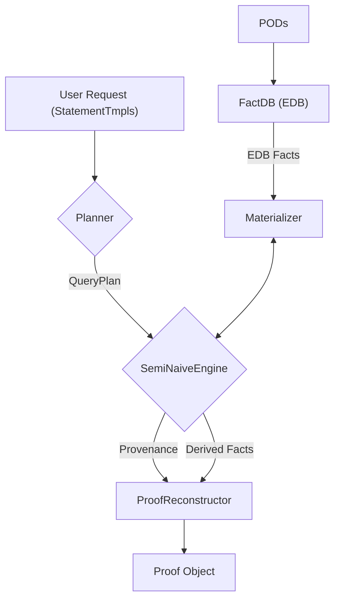

# The POD2 Solver

The POD2 solver is a Datalog-based reasoning engine responsible for proving statements based on facts asserted across a collection of PODs. It takes a user-defined query and a set of PODs as input, and if successful, produces a verifiable proof that can itself be encapsulated in a new POD.

## Conceptual Background

The solver's design is heavily influenced by concepts from deductive databases, specifically using Datalog as its logical foundation.

### Datalog in a Nutshell

Datalog is a declarative logic programming language that is a subset of Prolog. It's particularly well-suited for querying large sets of facts and deriving new information through rules. Key concepts include:

- **Facts**: Ground truths or basic pieces of information. In POD2, these are the `Statement`s asserted within PODs (e.g., `Equal(pod1["name"], "Alice")`).
- **EDB (Extensional Database)**: The set of all known facts. In our case, this is the collection of all statements from all input PODs, indexed in the `FactDB`.
- **Rules**: Logical implications that allow the derivation of new facts from existing ones. A rule has a _head_ (the conclusion) and a _body_ (the premises). For example: `parent(X, Y) :- father(X, Y).` means "If X is the father of Y, then X is a parent of Y".
- **IDB (Intensional Database)**: The set of facts derived by applying rules. These are not stored explicitly upfront but are generated by the solver during evaluation.
- **Queries**: A question posed to the system, asking if a particular fact (or set of facts) can be proven true. In our system, this role is performed by POD Requests.

### The POD2 Approach

The POD2 solver maps these Datalog concepts to the POD2 ecosystem:

- **EDB**: The `FactDB` (`src/solver/db.rs`) serves as the EDB. It consumes a set of `IndexablePod`s and builds an indexed, queryable database of all their public statements.
- **Rules & IDB**: Users define rules through custom predicates. The solver translates these into an internal Datalog representation (`src/solver/ir.rs`) and uses them to derive new facts (the IDB).
- **Queries**: A `REQUEST` block in a Podlong file defines the query—the ultimate goal the solver needs to prove.

## Solver Architecture & Process

The solving process can be broken down into three main phases: Planning, Evaluation, and Proof Reconstruction.



### 1. Planning

Before evaluation can begin, the user's query must be transformed into an efficient execution plan. This is the job of the `Planner` (`src/solver/planner.rs`).

1.  **IR Conversion**: The planner first takes all relevant custom predicate definitions and flattens them into a set of `Rule`s in the solver's Datalog Intermediate Representation (IR).
2.  **Magic Set Transformation**: A naive Datalog engine might try to compute _all possible facts_ derivable from the rules. The Magic Set Transformation rewrites the rules to be "goal-directed." It creates special "magic" predicates that represent the specific sets of values that are relevant to the original query. The original rules are then "guarded" by these magic predicates, ensuring the engine only works on data that could possibly contribute to the final proof. This drastically prunes the search space.
3.  **SIPS (Sideways Information Passing Strategy)**: The planner reorders the literals (premises) in a rule's body. It uses a "most-bound-first" strategy, meaning it prioritizes literals that have more constrained variables. This allows bindings to propagate efficiently through the rule, failing early if a join is impossible and reducing the amount of work done in later joins.

The output is a `QueryPlan` containing a set of optimized "magic" and "guarded" rules ready for execution.

### 2. Evaluation

The `SemiNaiveEngine` (`src/solver/engine/semi_naive.rs`) executes the `QueryPlan`.

- **Bottom-Up Evaluation**: It works "bottom-up" from the known facts in the EDB, applying rules to derive new facts (the IDB).
- **Semi-Naive Approach**: The "semi-naive" part is an optimization over a naive iterative approach. In each iteration, the engine only considers applying rules where at least one of the premises can be satisfied by a fact that was _newly derived_ in the _previous_ iteration. This avoids redundant re-computation of facts that have already been found.
- **Fixed Point**: The engine runs in a loop until no new facts can be derived in an entire iteration. At this point, it has reached a "fixed point," and the evaluation is complete.
- **Materialization**: During evaluation, the `Materializer` (`src/solver/semantics/materializer.rs`) is the bridge to the data. When the engine needs to find facts matching a rule's premise, it asks the Materializer. The Materializer can:
  - Look up pre-existing facts in the `FactDB`.
  - Dynamically evaluate native predicates (e.g., `Lt(5, 10)` becomes `true`).
  - Deduce values for free variables (e.g., in `SumOf(15, 10, ?z)`, it can deduce `?z = 5`).
    Predicate-specific logic for native predicates is encapsulated in `PredicateHandler`s.

### 3. Proof Reconstruction

During evaluation, the engine maintains a `ProvenanceStore`, which records exactly which rule and which specific variable bindings were used to derive each new fact.

If the final set of facts contains the user's original query goal, the `ProofReconstructor` (`src/solver/engine/proof_reconstruction.rs`) walks this provenance information backward from the goal fact. It builds a complete, verifiable `Proof` tree that shows the step-by-step derivation from the initial EDB facts to the final conclusion.

## How to Use the Solver

The primary entry point to the solver is the `solve` function in `src/solver/mod.rs`.

```rust
pub fn solve(
    request: &[StatementTmpl],
    pods: &[IndexablePod],
    params: &Params,
    metrics_level: MetricsLevel,
) -> Result<(Proof, MetricsReport), SolverError>
```

### Inputs

- `request: &[StatementTmpl]`: The query to be proven. This is typically generated by the Podlong parser from a `REQUEST` block. It's a slice of statement templates containing wildcards.
- `pods: &[IndexablePod]`: A slice of all the PODs that form the Extensional Database (EDB). The `IndexablePod` enum can wrap `SignedPod`s, `MainPod`s, or even test pods.
- `params: &Params`: A struct for configuring solver limits and behavior.
- `metrics_level: MetricsLevel`: An enum (`None`, `Counters`, `Debug`) that controls the level of performance metrics collected during execution. Using `None` provides the highest performance as it disables all metrics overhead.

### Outputs

- `Ok((Proof, MetricsReport))`: On success, it returns a tuple containing:
  - **`Proof`**: The final, verifiable proof object. This is the main result.
  - **`MetricsReport`**: A report containing any metrics that were collected, corresponding to the `metrics_level` input.
- `Err(SolverError)`: If a proof cannot be found or an internal error occurs.

## Working with Proofs

The `Proof` object (`src/solver/proof.rs`) is the most important output. It contains the full derivation tree for the proven goal. While you can inspect the tree directly, the most common use case is to convert it into the inputs needed for a new `MainPod`.

- `proof.to_inputs() -> (Vec<PodId>, Vec<(Operation, bool)>)`: This is the key method for consumers. It analyzes the proof and returns:
  1.  A minimal set of `PodId`s for the PODs that were required to prove the goal.
  2.  A topologically sorted list of `Operation`s that represents the computation steps of the proof. The boolean flag indicates if an operation should be public.

This output can be directly used with a `MainPodBuilder` to create a new `MainPod` that cryptographically attests to the result of the query.

## Debugging

The solver includes several features to aid in debugging:

- **Metrics**: Setting `metrics_level` to `Counters` or `Debug` provides insight into the evaluation process, such as the number of iterations and facts derived.
- **Explainer**: If a proof fails, the `MissingFactFinder` (`src/solver/explainer.rs`) can be used to identify which premises in which rules could not be satisfied. This helps pinpoint why a query is failing.
- **Visualization**: The `vis` module (`src/solver/vis.rs`) can generate visualizations of a `Proof` tree in either Graphviz DOT format or Mermaid markdown, which is useful for understanding complex derivations.
